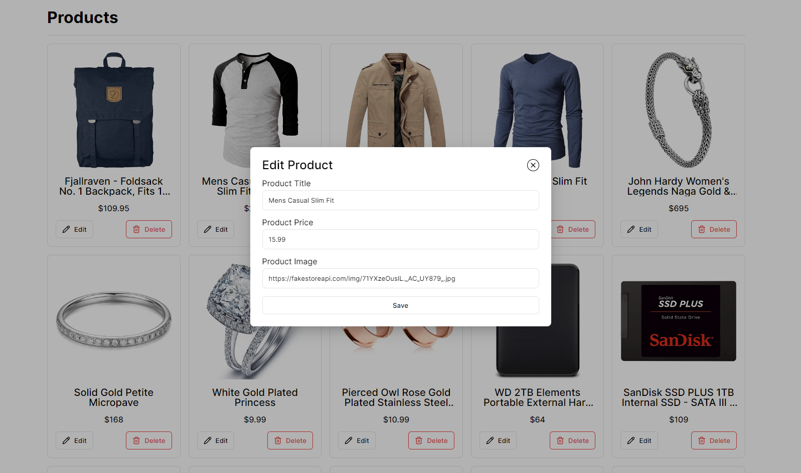

# Week-3

##### Assignment Author: Mustafa Emre TUFAN

## 📑 Assingment

👉 Ufak çaplı bir e ticaret sitesi yapacaksınız.  
👉 "https://fakestoreapi.com/products" API'sine istek atıp, sayfada ürünleri göstereceksiniz. Ürünlerin görselleri, title'ları, fiyatları gözükecek.  
👉 Product'larda bir delete butonu olacak, tıklayınca silinecek.  
👉 Product'larda edit butonu olacak. Ona basılınca product detayları modal'da gözükecek ve editlenebilecek. Modal için kütüphane kullanabilirsiniz.  
👉 Editleme ve silme işlemlerinden sonra sayfada başarılı veya başarısız olursa toast notifacation çıkacak. 3 Saniye sonra silinecek.  
👉 Componentler'a bölerek yapmanızı istiyorum ve en az 1 component, "Class Component" yapısında olmalı.  

## 💻 Code Structure

The project is structured as follows:

- `src/`: This is where all the source code of the application resides.
  - `App.tsx`: This is the main component of the application.
  - `components/`: This directory contains all the reusable components used across the application. Each component has its own directory with the component code and associated styles.
  - `pages/`: This directory contains all the page components. Currently, there is only one page, `Home`.
  - `styles/`: This directory contains global and reset styles.
  - `types/`: This directory contains TypeScript type definitions.
  - `main.tsx`: This is the entry point of the application.
- `tsconfig.json`: This file is used by TypeScript compiler to determine which files to compile and what compilation options to use.
- `vite.config.ts`: This file is used by Vite for project configuration.

## ⚙️ Installation and Setup

Follow these steps to setup and run the project:

1. Clone the repository to your local machine.
2. Navigate to the project directory.
3. Install the dependencies with `yarn install`.
4. Start the development server with `yarn dev`.
